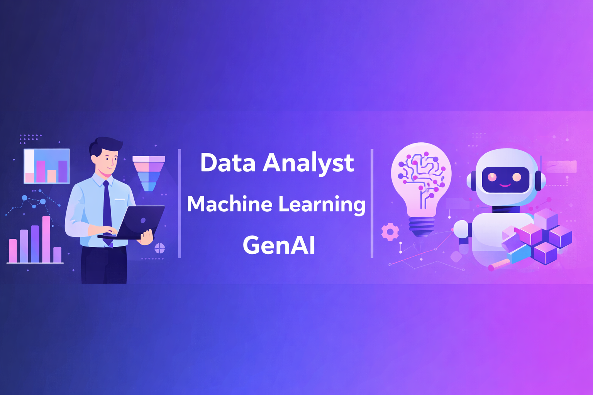

# Hi 👋, I'm Rahul

🚀 **Data Analyst | Aspiring Data Scientist | GenAI & ML Enthusiast**
📍 India

I am currently working as a **Data Analyst at Hive AI**, where I collaborate closely with product and engineering teams to drive data-informed decisions. I enjoy working with data, building intelligent systems, and turning raw information into meaningful insights across **analytics, machine learning, and GenAI**.

---

🧠 Skills & Expertise
📊 Data Analysis (Current Role)	🤖 Machine Learning
• KPI definition & tracking • Funnel & cohort analysis • A/B & multivariate testing • SQL pipelines & Power BI dashboards	• Regression (Linear, Logistic) • Tree-based models (Random Forest, Gradient Boosting) • Feature engineering & model evaluation
🧠 GenAI & NLP	🛠 Tools & Tech
• RAG (Retrieval Augmented Generation) • LangChain, Vector Embeddings • LLaMA-3 (Groq) • LSTM-based NLP models	• Python, SQL • Power BI, Pandas, NumPy • FastAPI, Streamlit • Git & GitHub

## 📫 Let’s Connect

* 💼 LinkedIn: [https://www.linkedin.com/in/rahul-gauniyal-32a130243/](https://www.linkedin.com/in/rahul-gauniyal-32a130243/)
* 📧 Email: [rahulgauniyal376@gmail.com](mailto:rahulgauniyal376@gmail.com)

---

⭐ *Thanks for visiting my profile! Feel free to explore my repositories and connect.*
